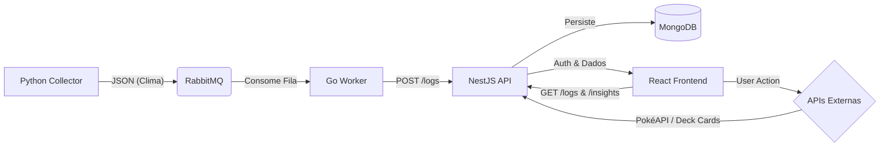

# Desafio GDASH - Full Stack Developer

Este repositório contém a solução completa para o desafio técnico GDASH. O projeto é uma aplicação baseada em microsserviços para monitoramento climático em tempo real, integrando coleta de dados, processamento em fila, API REST e Dashboard interativo com IA.

## 🚀 Tecnologias Utilizadas

- **Coleta de Dados:** Python (Schedule + Requests + Logging)
- **Mensageria:** RabbitMQ
- **Worker:** Go (Golang + AMQP)
- **Backend:** NestJS + MongoDB (Mongoose + Swagger)
- **Frontend:** React + Vite + TailwindCSS + Shadcn/UI + Recharts
- **Infraestrutura:** Docker & Docker Compose
- **CI/CD:** GitHub Actions

## 🏗️ Arquitetura do Sistema

O sistema segue uma arquitetura orientada a eventos:



## ✨ Funcionalidades e Bônus Implementados

### Obrigatórios
- [x] Pipeline completo (Python -> Rabbit -> Go -> Nest -> Mongo -> React).
- [x] Dashboard de Clima com dados reais (Open-Meteo).
- [x] Insights de IA baseados em histórico e regras de negócio.
- [x] Autenticação (JWT) e CRUD de usuários.
- [x] Docker Compose orquestrando tudo.

### Bônus (Extras)
- [x] **Múltiplos Gráficos:** Gráfico de Linha (Temp/Umidade) e Barras (Vento).
- [x] **Filtros:** Filtro de tempo no Dashboard (10min, 30min, etc).
- [x] **APIs Extras:** Integração rica com **PokéAPI** (Detalhes completos) e **Deck of Cards API** (Jogo interativo).
- [x] **Testes Automatizados:** Testes unitários no serviço de Clima (NestJS).
- [x] **CI/CD:** Pipeline configurado com GitHub Actions.
- [x] **Logs Detalhados:** Python com logging estruturado.
- [x] **Documentação:** Swagger configurado no Backend.

## 📦 Como Rodar

### Pré-requisitos
- Docker e Docker Compose instalados.

### Passo a Passo

1.  **Clone o repositório:**
    ```bash
    git clone https://github.com/SEU_USUARIO/desafio-gdash.git
    cd desafio-gdash
    ```

2.  **Configuração Inicial:**
    Copie o arquivo de exemplo de variáveis de ambiente:
    ```bash
    cp .env.example .env
    # Ou use o comando make:
    make setup
    ```

3.  **Subir a Aplicação:**
    ```bash
    docker compose up -d --build
    # Ou use o comando make:
    make up
    ```

4.  **Acessar os Serviços:**
    - **Frontend (Dashboard):** [http://localhost:5173](http://localhost:5173)
    - **API (Swagger Docs):** [http://localhost:3000/api/docs](http://localhost:3000/api/docs)
    - **RabbitMQ Admin:** [http://localhost:15672](http://localhost:15672) (User: `admin`, Pass: `password123`)

## 🔑 Acesso Inicial

Para acessar o Dashboard, utilize o usuário padrão criado automaticamente:

- **Email:** `admin@example.com`
- **Senha:** `123456`

## 🛠️ Comandos Úteis (Makefile)

Se você tiver o `make` instalado (Linux/WSL), pode usar os atalhos:

- `make setup`: Cria o arquivo .env
- `make up`: Sobe todo o ambiente
- `make down`: Para os containers
- `make logs`: Vê os logs em tempo real
- `make test-api`: Roda os testes unitários do Backend
- `make clean`: Limpa containers, volumes e pastas de build

## 📹 Vídeo Demonstrativo

[Link para o vídeo no YouTube](https://youtu.be/NABLerrzVDQ)

---
Desenvolvido por **Helton Barbosa Santos Ferreira**